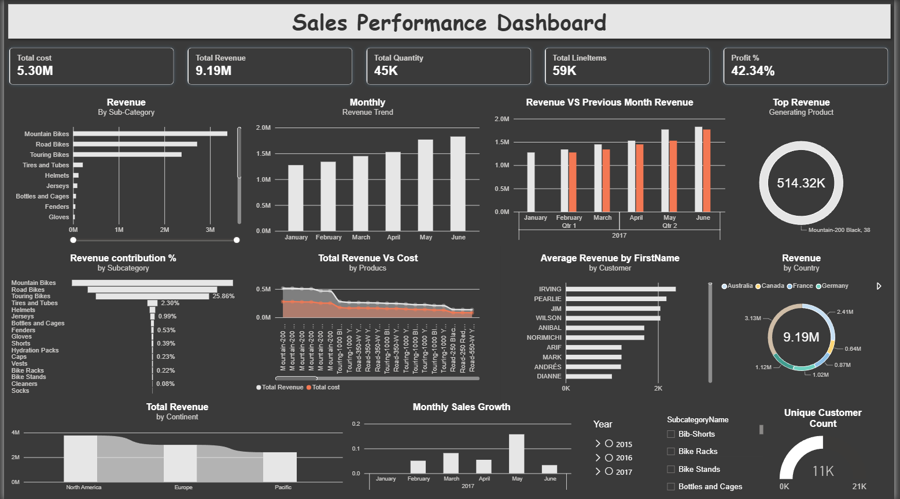
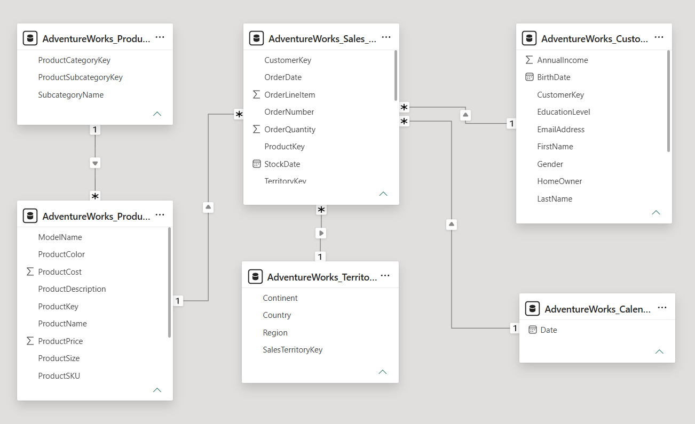

# AdventureWorks Sales & Profitability Dashboard (Power BI)

## 📌 Problem Statement
Built an interactive multi-page sales analytics dashboard using Power BI 
on the AdventureWorks 2017 sales dataset, covering revenue trends, 
profitability, customer behavior, and product performance across regions.

## 📊 Dashboard Overview


**KPI Cards:** Total Cost, Total Revenue, Total Quantity, Total Line Items, Profit %

**Visuals used (11 types):** Bar chart, Clustered column chart, Donut chart, 
Area chart, Line-column combo chart, Ribbon chart, Funnel, Cards, Slicers

## 🗄️ Data Model


The report uses a **snowflake schema** — a central fact table connected to 
five dimension tables, with the Products dimension further split into a 
Subcategory sub-dimension:
```
AdventureWorks_Sales (Fact table: OrderQuantity, OrderDate, ProductKey, CustomerKey, TerritoryKey)
    ├──> AdventureWorks_Products (ProductName, ProductPrice, ProductCost)
    ├──> AdventureWorks_Products_Subcategory (SubcategoryName)
    ├──> AdventureWorks_Customers (FirstName, Gender, BirthDate, AnnualIncome)
    ├──> AdventureWorks_Territory (Continent, Country, Region)
    └──> AdventureWorks_Calendar (Date table - model's date table)
```

This structure allows measures like `Total Revenue` to pull `ProductPrice` 
from the Products table via `RELATED()`, lets visuals break down sales by 
`SubcategoryName` through the snowflaked Subcategory table, and enables 
time-intelligence functions (`TOTALMTD`, `PREVIOUSMONTH`) to work correctly 
against the Calendar table..

## 🧠 DAX Measures

```dax
Total Revenue = SUMX(AdventureWorks_Sales, 
    AdventureWorks_Sales[OrderQuantity] * RELATED(AdventureWorks_Products[ProductPrice]))

Total cost = SUMX(AdventureWorks_Sales, 
    AdventureWorks_Sales[OrderQuantity] * RELATED(AdventureWorks_Products[ProductCost]))

Profits = [Total Revenue] - [Total cost]

Profit % = DIVIDE([Profits], [Total Revenue], 0)

Previous month Revenue = CALCULATE([Total Revenue], PREVIOUSMONTH(AdventureWorks_Calendar[Date]))

Sales Growth MoM = 
VAR total_Revenue = [Total Revenue]
VAR Previous_revenue = [Previous month Revenue]
RETURN DIVIDE(total_Revenue - Previous_revenue, Previous_revenue, 0)

Revenue MTD = TOTALMTD([Total Revenue], AdventureWorks_Calendar[Date])
Revenue YTD = TOTALYTD([Total Revenue], AdventureWorks_Calendar[Date])

Average Revenue = DIVIDE([Total Revenue], AdventureWorks_Sales[Total Quantity])

Product contribution % = DIVIDE([Total Revenue], 
    CALCULATE([Total Revenue], ALL(AdventureWorks_Products)))

Ranks = RANKX(ALL(AdventureWorks_Products[ProductName]), [Total Revenue], , DESC)

Unique Customers = CALCULATE(
    COUNT(AdventureWorks_Customers[CustomerKey]),
    FILTER(AdventureWorks_Sales, AdventureWorks_Sales[Total Revenue] > 0)
)
```

## 🔍 Key Insights
- Mountain Bikes is the top-performing sub-category, contributing 25.86% 
  of total revenue.
- The single highest revenue-generating product is "Mountain-200 Black, 38" 
  at ₹514.32K.
- Overall profit margin stands at 42.34% — a healthy margin across the 
  product portfolio.
- Revenue has shown consistent month-over-month growth from January 
  through June 2017.
- North America leads revenue by continent, followed by Europe and Pacific.

## 💡 Challenges & Learnings
- **Naming vs. logic mismatch**: My initial `Profit %` measure was written 
  as `DIVIDE([Total Revenue], [Total cost])`, which actually calculates a 
  revenue-to-cost ratio (1.73), not a true profit margin. I corrected it to 
  `DIVIDE([Profits], [Total Revenue])` to reflect the actual percentage of 
  revenue retained as profit (42.34%) — a reminder to always sanity-check 
  what a metric name implies against what the formula actually computes.
- **Time intelligence**: Learned to use `PREVIOUSMONTH()` and `TOTALMTD()`/
  `TOTALYTD()` for period-over-period comparisons, which required a proper 
  date table (`AdventureWorks_Calendar`) marked as the model's date table.
- **RANKX with ALL()**: Used `RANKX` combined with `ALL()` to rank products 
  independent of any report-level filters, ensuring consistent rankings 
  regardless of slicer selections.
- **Built beyond the brief**: The task requirement only asked for revenue, 
  cost, and profit tracking, but I additionally built `Revenue MTD`, 
  `Revenue YTD`, and `Ranks` measures to practice time-intelligence and 
  ranking functions. These aren't visualized on the current dashboard page 
  since they weren't part of the requirement, but they're included in the 
  `.pbix` file's measure list as extra self-directed practice.

## 🛠️ Tools Used
Power BI Desktop, DAX (Time Intelligence, RANKX, CALCULATE, SUMX, VAR/RETURN)

## 📁 Files
- `Adventureworks_sales.pbix` — full Power BI report file
- `screenshots/dashboard_overview.png` — dashboard screenshot
- `screenshots/Data_Model.png` — data model / schema diagram

## 🔗 Related Projects
- [Retail Sales Data Cleaning & Dashboard (Excel)](https://github.com/RyanMarco-13/retail-sales-data-cleaning-analysis)
- [Retail Sales SQL Analysis](https://github.com/RyanMarco-13/retail-sales-sql-analysis)
- [Employee Database SQL Analysis](https://github.com/RyanMarco-13/employees-database-sql-analysis)
- [Retail Category Sales Dashboard (Power BI)](https://github.com/RyanMarco-13/retail-category-sales-dashboard-powerbi)
